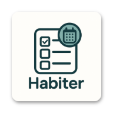

<div align="center">



# Habiter

**Build better habits. Keep your data yours.**

A polished, local-first habit tracker for mobile, desktop, and web — built with Flutter and shipped through a signed, reproducible release pipeline.

[](https://github.com/marius4lui/habiter/actions/workflows/quality.yml)
[](https://github.com/marius4lui/habiter/actions/workflows/platform-builds.yml)
[](https://github.com/marius4lui/habiter/actions/workflows/worker-deploy.yml)
[](https://flutter.dev)
[](apps/habiter/pubspec.yaml)

[Website](https://habiter.dev) · [Download](https://get.habiter.dev/download) · [Documentation](docs/) · [Release API](https://get.habiter.dev/health)

</div>

---

## Why Habiter?

Habiter helps you turn intentions into routines without turning your personal history into somebody else's dataset. Habits, entries, preferences, and insights remain local to your device. No account is required for the core experience.

<table>
<tr>
<td width="50%" valign="top">

### Private by default

Your habit data stays on your device. Sensitive integration credentials use secure platform storage, and core tracking works without a remote account.

### Built for real routines

Create daily, weekday-based, or weekly-frequency habits. Pause, resume, archive, restore, and review them without losing their history.

### Thoughtful reminders

Timezone-aware scheduling, explicit permission flows, stable notification IDs, and reconciliation keep reminders predictable across restarts and edits.

</td>
<td width="50%" valign="top">

### Progress you can understand

Streaks, completion rates, weekly charts, lifecycle-aware statistics, and local coaching turn history into useful feedback.

### Mobile and desktop native

One Flutter codebase powers focused mobile navigation and responsive desktop layouts across the supported platforms.

### Accessible and multilingual

Responsive screens are tested at narrow widths and large text sizes. The interface ships in English and German.

</td>
</tr>
</table>

## Platform support

| Platform | CI build | Distribution | Signing status |
| --- | :---: | --- | --- |
| Android | ✅ | Universal APK and Play Store AAB | Signed and fingerprint-verified |
| Windows | ✅ | x64 ZIP | Checksum verified; code signing planned |
| Linux | ✅ | x64 tarball | Checksum verified |
| macOS | ✅ | Universal ZIP | Checksum verified; code signing planned |
| iOS | ✅ | Unsigned CI build | Manual signing and distribution gate |
| Web | ✅ | Flutter web build | Build validation only |

> The public release line restarts at **v1.0.0**. Until the first production tag is published, download routes may not have a released artifact to serve.

## Download

The smart download endpoint detects Android, Windows, Linux, or macOS and redirects to the matching artifact. Platform and architecture can also be selected explicitly through query parameters.

<div align="center">

### [Download Habiter](https://get.habiter.dev/download)

`https://get.habiter.dev/download`

</div>

## Repository

```text
habiter/
├── apps/
│   ├── habiter/          Flutter application and platform projects
│   ├── website/          Standalone, dependency-free product website
│   └── release-api/      Cloudflare Worker for releases and downloads
├── packages/
│   └── release-core/     Release schema, manifest, validation, and metadata
├── scripts/
│   ├── release/          Deterministic release tooling
│   └── website/          Website contract validation
├── docs/                 Product and engineering documentation
└── .github/workflows/    Quality, builds, previews, deploys, and releases
```

The release manifest in `packages/release-core/data/releases.json` is the reviewed source of truth. The Worker exposes that data through versioned, cache-aware endpoints and provides deterministic update and download decisions.

## Getting started

### Requirements

- Flutter `3.44.8`
- Node.js `24.13.1`
- pnpm `11.21.0`
- Java `17` for Android builds

### Run the app

```bash
git clone https://github.com/marius4lui/habiter.git
cd habiter/apps/habiter
flutter pub get --enforce-lockfile
flutter run
```

### Run the complete quality suite

```bash
# Flutter
cd apps/habiter
dart format --output=none --set-exit-if-changed .
flutter analyze --fatal-infos
flutter test

# Worker, release tooling, and website
cd ../..
pnpm install --frozen-lockfile
pnpm release:validate
pnpm release:test
pnpm website:check
pnpm --filter @habiter/release-api types
pnpm --filter @habiter/release-api check
pnpm --filter @habiter/release-api deploy:dry
```

### Run the website

The marketing website is a Next.js App Router application written in TypeScript.

```bash
pnpm website:dev
```

Open `http://localhost:3000`. Use `pnpm website:check` for the complete website contract, type, and production-build checks.

## Release API

| Endpoint | Purpose |
| --- | --- |
| `GET /health` | Deployment health and environment |
| `GET /api/v1/releases` | Paginated published releases |
| `GET /api/v1/releases/latest` | Latest release for a channel |
| `GET /api/v1/releases/:version` | One concrete release |
| `GET /api/v1/update/:platform` | Version and build update decision |
| `GET /api/v1/download/:platform` | Latest platform download |
| `GET /download` | User-Agent-aware download redirect |

Concrete release responses are immutable; latest, update, and download decisions use short cache windows. Errors share a stable JSON contract with a request ID.

## Delivery model

- Every push and pull request runs formatting, analysis, tests, schema checks, Worker contracts, website validation, documentation builds, and secret scanning.
- Platform builds cover Android, Windows, Linux, macOS, web, and unsigned iOS.
- Pull requests that affect the Worker receive isolated preview deployments.
- Relevant pushes to `main` deploy the production Worker through GitHub Actions.
- Only a matching `v<semver>` tag can start an application release.
- Android APK and AAB artifacts must pass signature and certificate-fingerprint verification before publication.
- A GitHub Release remains a draft until every artifact, checksum, metadata file, and API deployment succeeds.

See the [release operating model](docs/release-operations.md) for versioning, signing, recovery, rollback, and secret rotation.
The [mobile UX system](docs/mobile-ux-system.md) documents the product hierarchy, design primitives, accessibility contract, and visual regression matrix.

## Contributing

Issues and focused pull requests are welcome. Before opening a change, run the relevant local checks above and keep application, Worker, release-core, website, and documentation changes logically separated.

For larger changes, describe the user problem and migration impact first so behavior and data compatibility can be reviewed alongside the implementation.

---

<div align="center">

**Made with care, Flutter, and a healthy respect for local data.**

If Habiter helps you stay consistent, consider giving the repository a ⭐.

</div>
